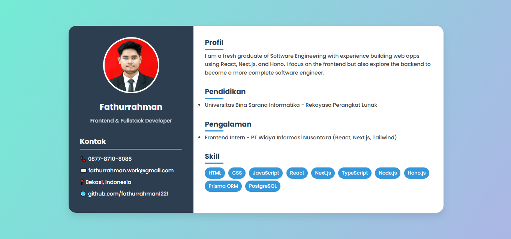

# Simple CV Project

A simple CV (Curriculum Vitae) project built using **HTML**, **CSS**, and **JavaScript**.  
This project was created as an assignment for **Week 1** of the **Sinau Koding Bootcamp**.

## 📂 Project Structure

```
.
├── index.html   # Main CV page
├── style.css    # Styling for the CV
└── script.js    # JavaScript for interactivity
```

## 📸 Preview

<summary>
<details>



</details>
</summary>

## 💻 How to Run

1. Clone this repository:

   ```bash
   git clone https://github.com/fathurrahman20/simple-cv.git
   ```

2. Open `index.html` in your browser.
